# Library Management System
## UAS Pengembangan Aplikasi Web - Kelompok 9

> **Studi Kasus:** Library Management System (Digit 7)  
> **Mata Kuliah:** IF25-22014 - Pengembangan Aplikasi Web  
> **Dosen Pengampu:** M Habib Algifari, S.Kom., M.T.I.

---

## Tim Pengembang

| Nama | NIM | Role | Pembagian Tugas |
|------|-----|------|-----------------|
| Muhammad Nurikhsan | 123140057 | Team Leader | Koordinasi tim, integrasi FE-BE, deployment, dokumentasi & video |
| Muharyan Syaifullah | 123140045 | Frontend Developer | Struktur & routing FE, desain UI/UX, halaman Librarian (dashboard, inventory), responsive layout |
| Nadia Antashiva | 123140060 | Frontend Developer | State management (context/store), halaman Member (catalog, history, profile), form login/register & validation |
| Aryasatya Widyatna Akbar | 123140164 | Backend Developer | API auth & borrowing, aturan limit/denda, middleware CORS, error handling |
| Marcel Kevin Togap Siagian | 123140054 | Backend Developer | API buku (CRUD, search), validasi payload, seed data, sinkronisasi Alembic |
| Ivan Nandira Mangunang | 123140094 | Database Specialist | Desain schema PostgreSQL, relasi users-books-borrowings, tuning query, backup/migrasi |

---

## Deskripsi Project

Aplikasi **Library Management System** adalah sistem manajemen perpustakaan digital yang memungkinkan anggota untuk meminjam buku dan pustakawan untuk mengelola koleksi buku serta transaksi peminjaman. Sistem ini dibangun menggunakan **Python Pyramid Framework** untuk backend dan **ReactJS** untuk frontend dengan database **PostgreSQL**.

### Fitur Utama

#### Fitur Wajib (Core Features):

1. **User Authentication**
   - Register dan Login dengan role Member dan Librarian
   - JWT-based authentication
   - Password hashing dengan Bcrypt

2. **Book Management**
   - Librarian: CRUD buku (title, author, ISBN, category, copies)
   - Member: Browse dan search katalog buku

3. **Borrowing System**
   - Member dapat meminjam maksimal 3 buku
   - Periode peminjaman 14 hari
   - Status: Pending → Approved → Active → Returned

4. **Return System**
   - Librarian memproses pengembalian buku
   - Perhitungan denda otomatis: Rp 5.000/hari keterlambatan

5. **Search & Filter**
   - Pencarian berdasarkan judul, penulis, atau kategori
   - Filter by kategori dan ketersediaan buku

6. **History & Dashboard**
   - Member: Riwayat peminjaman pribadi
   - Librarian: Dashboard transaksi semua peminjaman

---

## Tech Stack

### Frontend
- **Framework:** ReactJS (Vite)
- **Routing:** React Router v6
- **HTTP Client:** Axios
- **Styling:** CSS (Custom) + Tailwind CSS
- **State Management:** React Context API

### Backend
- **Framework:** Python Pyramid Framework
- **ORM:** SQLAlchemy
- **Database Migrations:** Alembic
- **Authentication:** JWT (PyJWT)
- **Password Hashing:** Bcrypt

### Database
- **DBMS:** PostgreSQL
- **Hosting:** Railway (Production)
- **Tables:** users, books, borrowings

### Deployment
- **Frontend:** Vercel
- **Backend:** [Domain *.web.id - To be deployed]
- **Database:** Railway PostgreSQL

---

## Struktur Project

```
uas-paw-kelompok-9/
├── backend/                    # Python Pyramid Backend
│   ├── app/
│   │   ├── models/            # Database Models
│   │   │   ├── user.py        # User & UserRole
│   │   │   ├── book.py        # Book model
│   │   │   └── borrowing.py   # Borrowing & BorrowStatus
│   │   ├── views/             # API Endpoints
│   │   │   ├── auth.py        # Authentication endpoints
│   │   │   ├── book.py        # Book management
│   │   │   ├── borrowing.py   # Borrowing operations
│   │   │   └── user.py        # User management
│   │   └── routes.py          # URL routing configuration
│   ├── alembic/               # Database migrations
│   ├── development.ini        # Pyramid configuration
│   ├── requirements.txt       # Python dependencies
│   ├── run.py                 # Application entry point
│   └── .env.example           # Environment variables template
│
├── frontend/                   # React Frontend
│   ├── src/
│   │   ├── components/        # Reusable components
│   │   ├── pages/             # Page components
│   │   │   ├── librarian/     # Librarian dashboard & views
│   │   │   └── user/          # Member views
│   │   ├── auth/              # Authentication context
│   │   ├── api/               # API client & endpoints
│   │   ├── store/             # State management
│   │   └── styles/            # Global styles
│   ├── package.json           # Node dependencies
│   └── vite.config.js         # Vite configuration
│
└── README.md                   # Project documentation
```

---

## Cara Instalasi dan Menjalankan

### Prerequisites
- Python 3.9+
- Node.js 16+
- PostgreSQL 13+
- Git

### 1. Clone Repository

```bash
git clone https://github.com/[username]/uas-paw-kelompok-9.git
cd uas-paw-kelompok-9
```

### 2. Setup Backend

```bash
cd backend

# Install dependencies
pip install -r requirements.txt

# Setup environment variables
cp .env.example .env
# Edit .env dengan kredensial database Anda

# Run database migrations
alembic upgrade head

# (Optional) Seed data untuk testing
python seed_data.py

# Run server
python run.py
```

Backend akan berjalan di `http://localhost:6543`

### 3. Setup Frontend

```bash
cd frontend

# Install dependencies
npm install

# Run development server
npm run dev
```

Frontend akan berjalan di `http://localhost:5173`

### 4. Login Credentials (Setelah Seed)

**Librarian:**
- Email: `librarian@library.com`
- Password: `librarian123`

**Member:**
- Email: `member@library.com`
- Password: `member123`

---

## Link Deployment

- **Frontend (Vercel):** [https://[project-name].vercel.app](https://uas-paw-kelompok-9-librarizz.vercel.app/)
- **Backend (Domain):** [https://[domain-name].web.id](huas-paw-kelompok-9-production.up.railway.app)
- **Video Presentasi:** [Link YouTube/Google Drive - To be added]

---

## API Documentation

### Base URL
- **Local:** `http://localhost:6543/api`
- **Production:** `uas-paw-kelompok-9-production.up.railway.app/api`

### Authentication Endpoints

#### 1. Register
```http
POST /api/auth/register
Content-Type: application/json


```

#### 2. Login
```http
POST /api/auth/login
Content-Type: application/json


```

#### 3. Get Current User
```http
GET /api/auth/me
Authorization: Bearer {token}


```

### Book Endpoints

#### 4. Get All Books
```http
GET /api/books?category=Fiction&available=true


```

#### 5. Get Book Detail
```http
GET /api/books/{id}


```

#### 6. Search Books
```http
GET /api/books/search?q=Harry


```

#### 7. Create Book (Librarian Only)
```http
POST /api/books
Authorization: Bearer {librarian-token}
Content-Type: application/json


```

#### 8. Update Book (Librarian Only)
```http
PUT /api/books/{id}
Authorization: Bearer {librarian-token}
Content-Type: application/json


```

#### 9. Delete Book (Librarian Only)
```http
DELETE /api/books/{id}
Authorization: Bearer {librarian-token}


```

### Borrowing Endpoints

#### 10. Create Borrow Request
```http
POST /api/borrowings
Authorization: Bearer {token}
Content-Type: application/json


```

#### 11. Get My Borrowings
```http
GET /api/borrowings/my
Authorization: Bearer {token}


```

#### 12. Get Borrowing History
```http
GET /api/borrowings/history
Authorization: Bearer {token}


```

#### 13. Request Return
```http
POST /api/borrowings/{id}/return
Authorization: Bearer {token}


```

#### 14. Approve Borrowing (Librarian Only)
```http
POST /api/borrowings/{id}/approve
Authorization: Bearer {librarian-token}


```

#### 15. Approve Return (Librarian Only)
```http
POST /api/borrowings/{id}/approve-return
Authorization: Bearer {librarian-token}


```

---

## Database Schema

### ERD (Entity Relationship Diagram)

```
┌─────────────┐         ┌──────────────┐         ┌─────────────┐
│    Users    │         │  Borrowings  │         │    Books    │
├─────────────┤         ├──────────────┤         ├─────────────┤
│ id (PK)     │────┐    │ id (PK)      │    ┌────│ id (PK)     │
│ name        │    └───<│ member_id(FK)│    │    │ title       │
│ email       │         │ book_id (FK) │>───┘    │ author      │
│ password    │         │ borrow_date  │         │ isbn        │
│ role        │         │ due_date     │         │ category    │
└─────────────┘         │ return_date  │         │ copies_total│
                        │ fine         │         │ copies_avail│
                        │ status       │         │ description │
                        └──────────────┘         │ cover_image │
                                                 └─────────────┘
```


## Screenshots (Ringkas)

### Autentikasi
Alur login/register dengan JWT: user membuat akun atau masuk, token disimpan FE lalu dipakai untuk memanggil endpoint proteksi.
<p>
   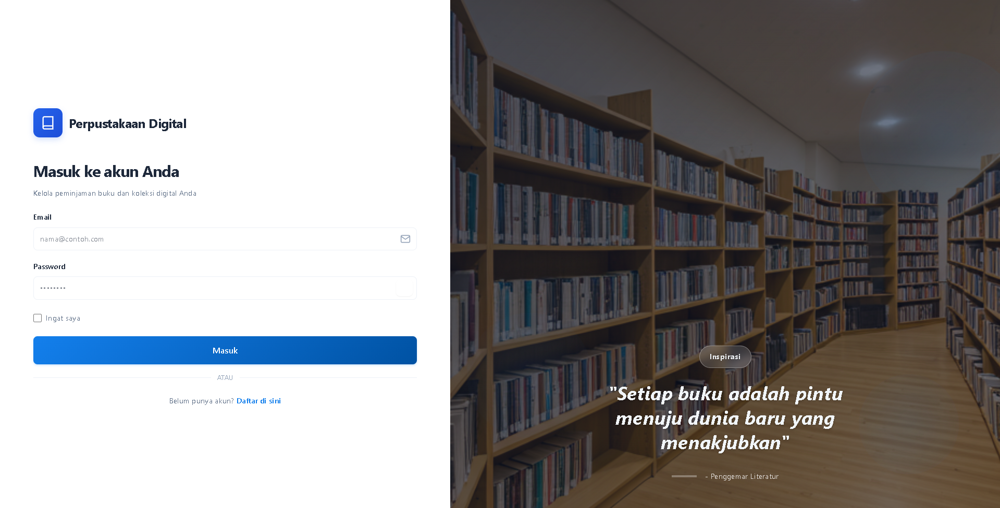
   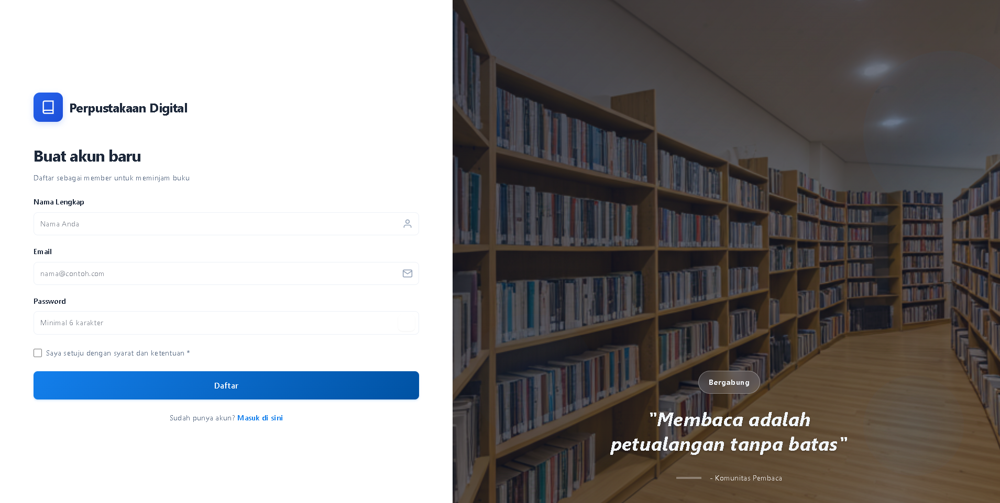
</p>

### Member (2 kolom)
Alur member: melihat katalog, meminjam (pending/active), memantau riwayat dan profil.
<p>
   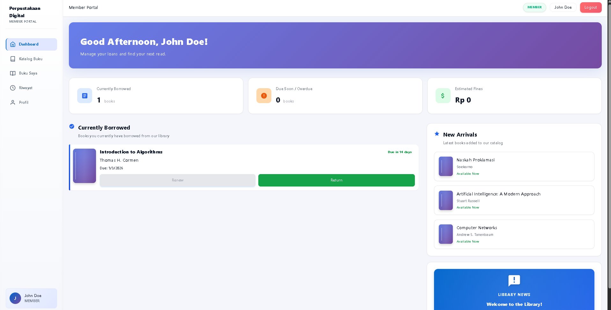
   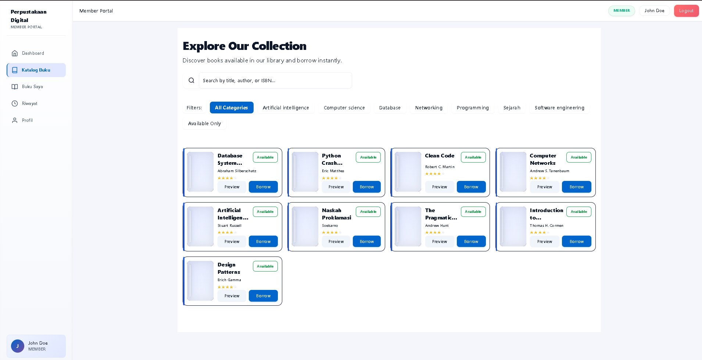
   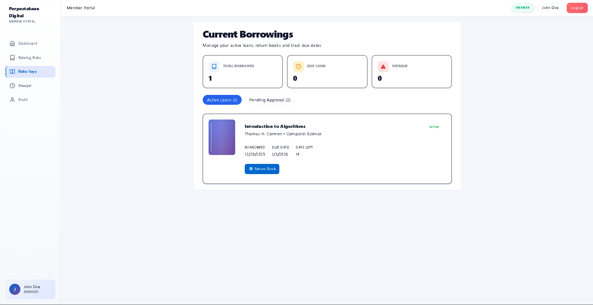
   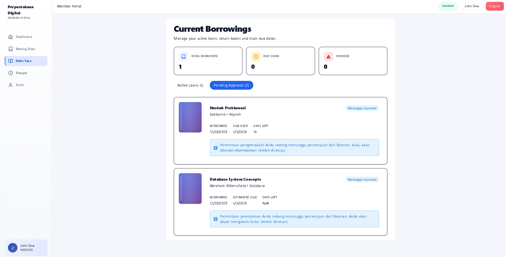
   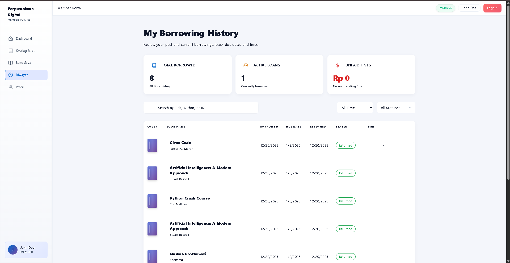
   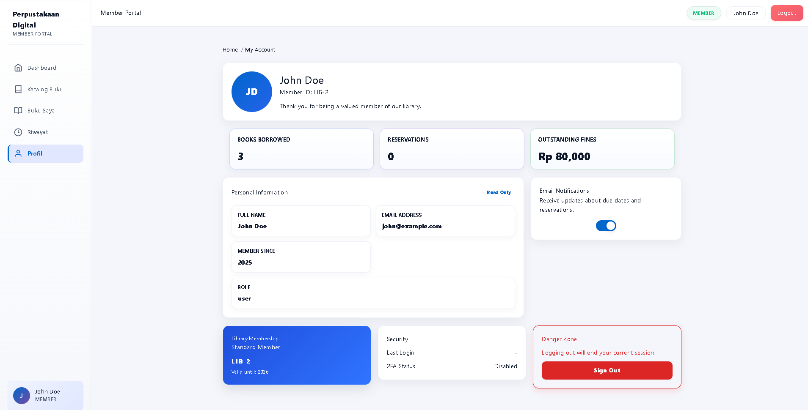
</p>

### Librarian (2 kolom)
Alur librarian: mengelola stok/CRUD buku, menyetujui/menolak pinjaman, memproses pengembalian, memantau transaksi dan member.
<p>
   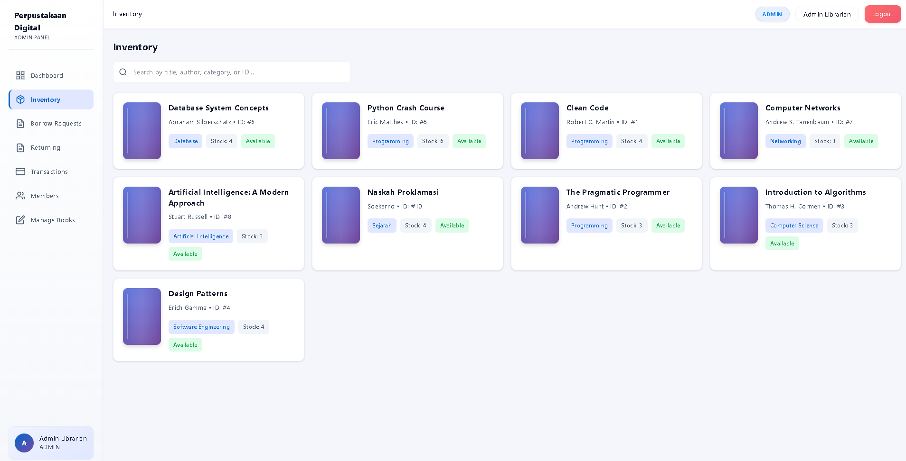
   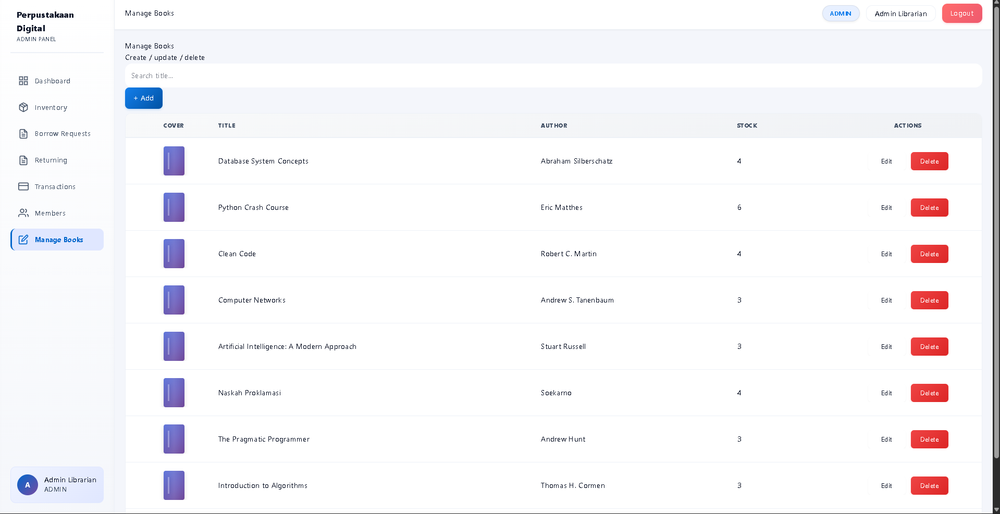
   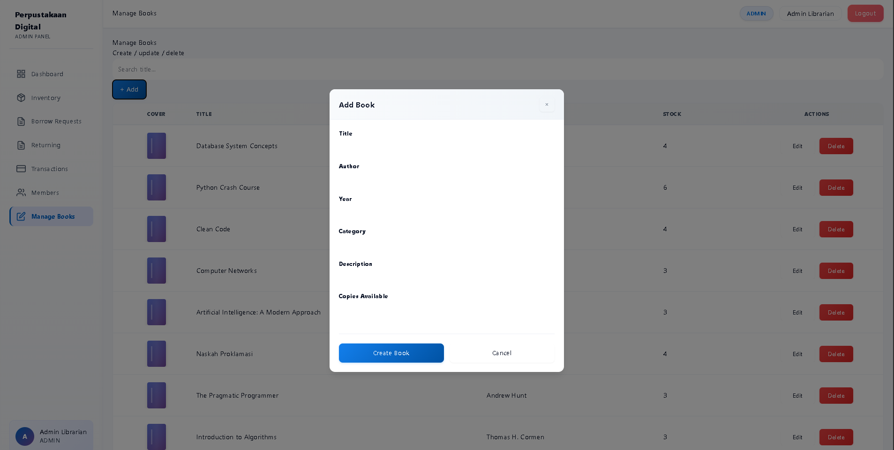
   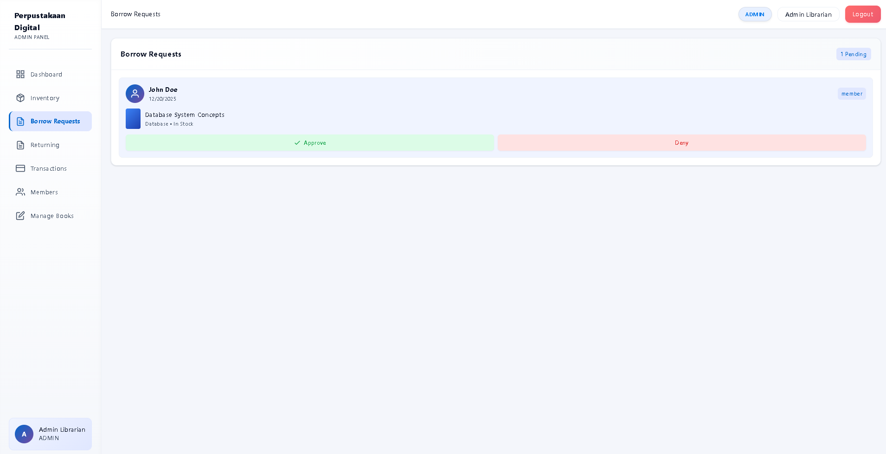
   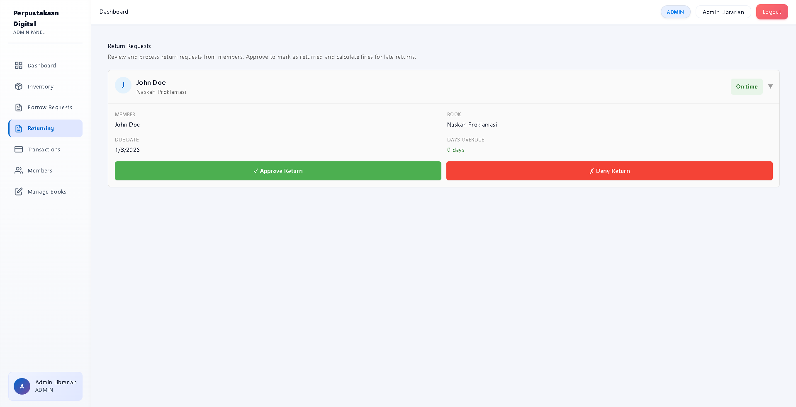
   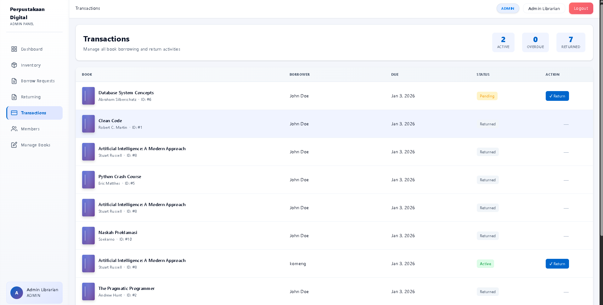
   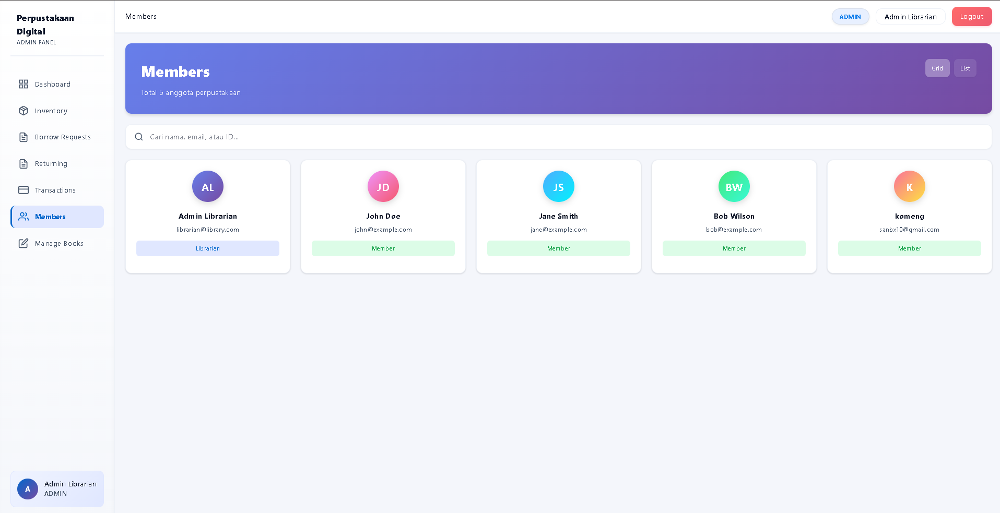
</p>

---

## Video Presentasi

**Link Video:** https://s.itera.id/presentasi-kelompok9-pawRB

---

## Checklist Pengerjaan

### Frontend
- 6+ functional components dengan proper hierarchy
- useState dan useEffect implementation
- Responsive design (Flexbox/Grid)
- 3+ forms dengan validation
- React Router untuk navigasi
- Loading states dan error handling

### Backend
- 15+ RESTful API endpoints
- Proper HTTP methods (GET, POST, PUT, DELETE)
- JSON response format
- Business logic dengan OOP
- Data validation dan error handling

### Database
- PostgreSQL dengan SQLAlchemy ORM
- 3 tabel dengan relasi (One-to-Many)
- Alembic migrations
- Seed data untuk testing

### Authentication & Authorization
- User register dan login
- Password hashing (bcrypt)
- JWT token management
- Protected routes
- Role-based access (Member & Librarian)

### Deployment & Documentation
- Frontend deployed to Vercel
- Backend deployed to *.web.id domain
- Database PostgreSQL di Railway
- README lengkap dengan API docs
- Code comments yang membantu
- Video presentasi (max 10 menit)

---

## Development Notes

### Known Issues & Limitations
- File upload untuk cover buku masih menggunakan URL string
- Pagination belum diimplementasikan untuk list buku
- Email notification belum tersedia

### Future Improvements
- Implementasi book reservation system
- Rating dan review untuk buku
- Export laporan ke PDF/Excel
- Email notification untuk due date reminder
- Admin panel untuk statistik lengkap

---

## Acknowledgments

- **Dosen Pengampu:** M Habib Algifari, S.Kom., M.T.I.
- **Program Studi:** Teknik Informatika
- **Fakultas:** Teknologi Industri
- **Institut:** Institut Teknologi Sumatera

---

**Kelompok 9 - IF25-22014 Pengembangan Aplikasi Web RB**
